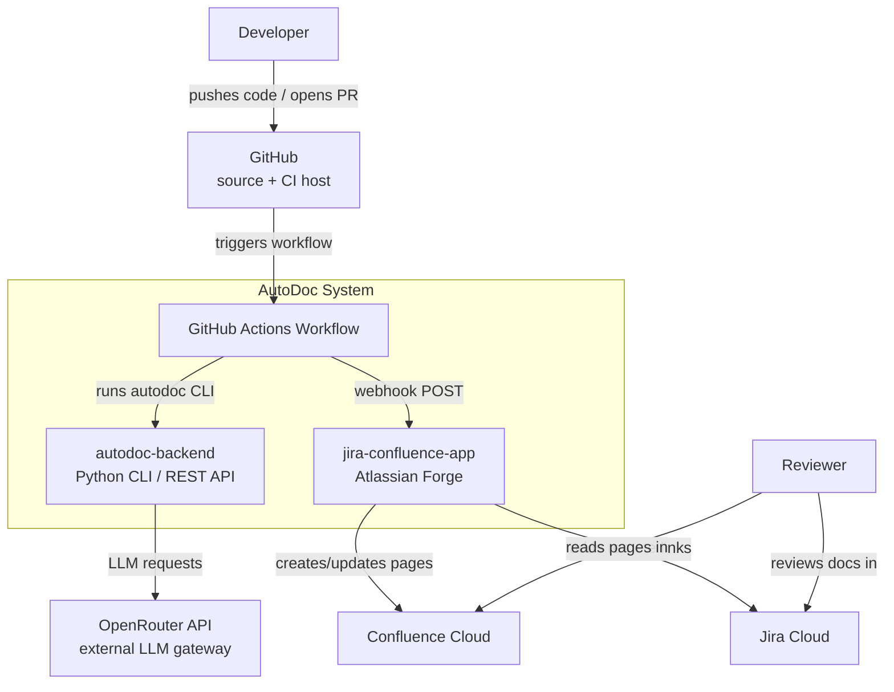
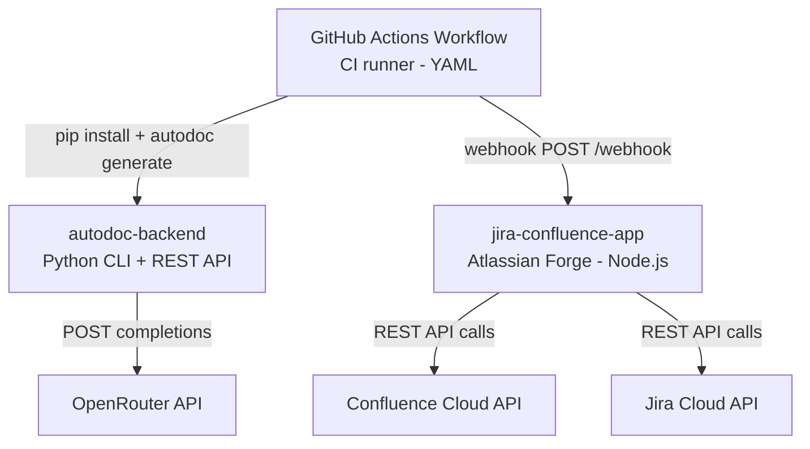
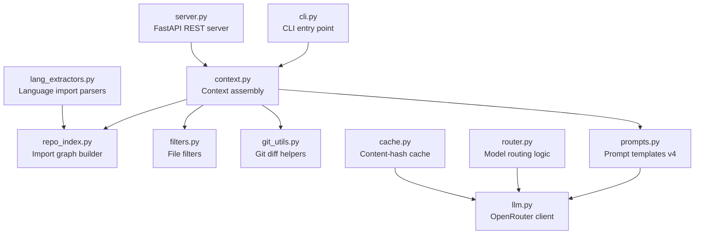
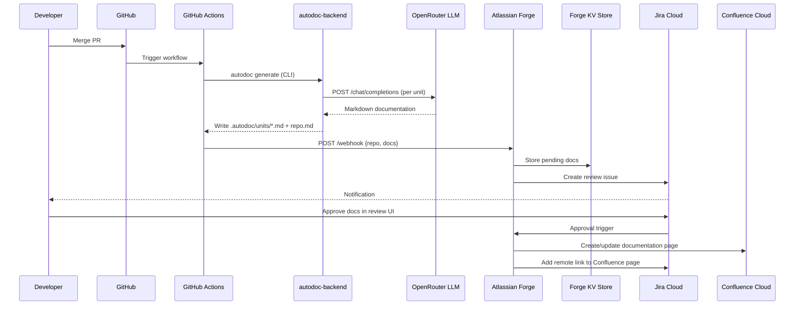
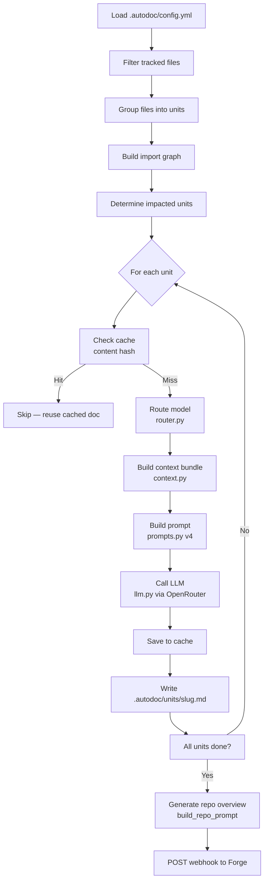

# AutoDoc Architecture

## 1. System Context (C4 Level 1)

---

## 2. Container Diagram (C4 Level 2)

---

## 3. Backend Component Diagram (C4 Level 3)

---

## 4. End-to-End Sequence Diagram

---

## 5. Documentation Generation Flow (Single Unit)

